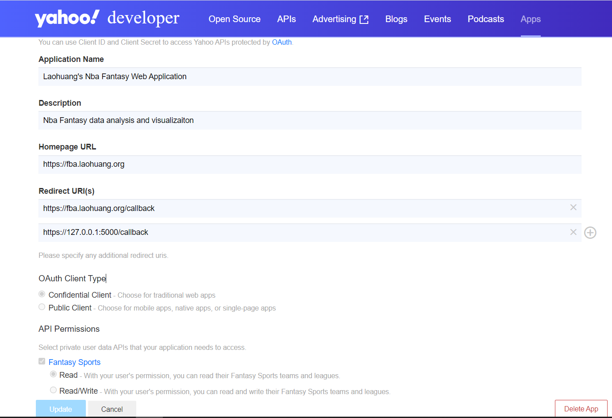

# Yahoo NBA Fantasy Analysis and Visualization

Web application to display yahoo fantasy basketball data analysis result.

**Technology stack**

- Flask Framework - Web Framework
- Bootstrap - Web page display style
- Pandas/matplotlib - Create all kinds of chart
- Yahoo OAuth - Yahoo Authorization
- Yahoo Fantasy API - Read data using Restful API
- Route53 - Register a domain for deployment
- [aws-lambda-web-adapter](https://github.com/awslabs/aws-lambda-web-adapter) - deploy the web application to AWS

## For Users

goto https://fba.laohuang.org and try it, you need to sign in with your Yahoo account to see your result.

## For Developers

### Prerequisites

1. have python installed

1. create an application in Yahoo developer https://developer.yahoo.com/apps/
   
   - Homepage URL: The url you plan to deploy your website to
   - Redirect URI(s): Besides the deployed url, also add https://127.0.0.1:5000/callback for your local deployment. 
     
     Please Note: you can only add http**s**, not http, so when you run locally, you also need to run it with https.
   - OAuth Client Type: Choose 'Confidential Client' 
   - API Permissions: Fantasy Sports - Read

   Then note down the client id and client secret, we will use it later.
### Hwo to run it locally

1. create a virtual enviroment 
   `python -m venv .\venv`

1. Activate the virtual environment
   `.\venv\Scripts\activate.bat`  (Windows)

   Then it will show something like this
   > (venv) D:\personal\project\yfb-web-app>

1. set pip version (the latest version may have problem in install )

   `python -m pip install pip==21.3.1`

1. install dependency
   `pip isntall -r requirements.txt`

1. edit the credential file in the root folder. Put the *Client ID (Consumer Key)* in the first line, and *Client Secret (Consumer Secret)* in the second line.
   

1. run the application
   `flask run --cert=.\cert\cert.pem --key=.\cert\key.pem --debugger`

### Deployment

I use AWS API Gateway and Lambda to deploy.

1. build the docker image
   `docker build .`

2. tag the image
   `docker tag xxx yyy.dkr.ecr.us-east-1.amazonaws.com/zzz:v1`
    
    here xxx is your docker image id, yyy is your aws account id, zzz is your ECR repo name, v1 is the tag of this image

3. push the image to ECR
   `aws ecr get-login-password | docker login -u AWS --password-stdin "yyy.dkr.ecr.us-east-1.amazonaws.com"`
   `docker push yyy.dkr.ecr.us-east-1.amazonaws.com/zzz:v1`

4. Create a lambda funciton using the image

5. Create an api gateway as the trigger of this lambda function.
   
   Please note, you need to add route for both / and /{proxy+}

